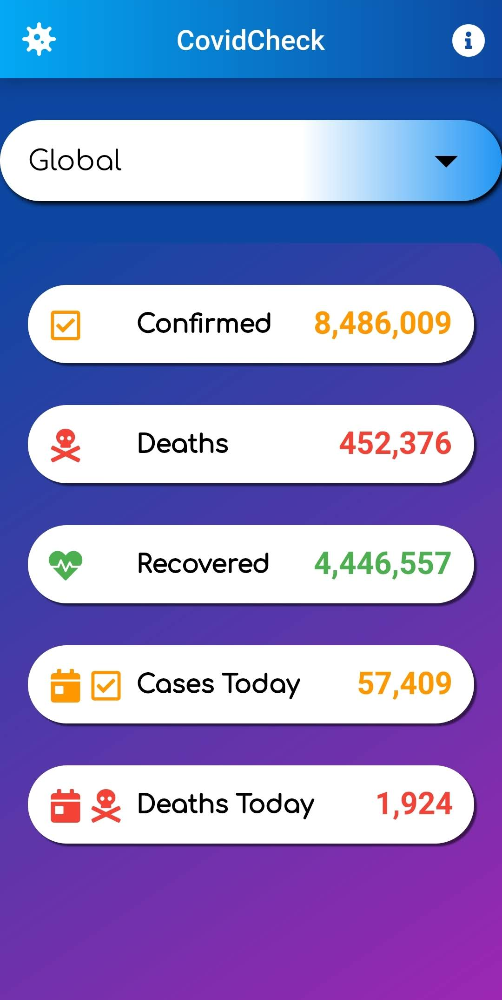
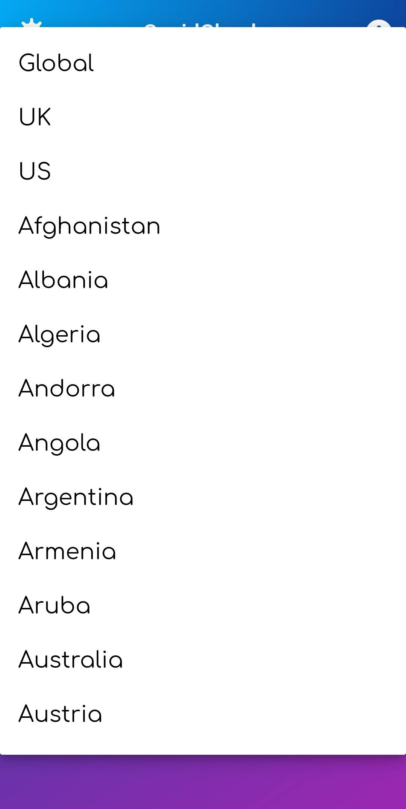
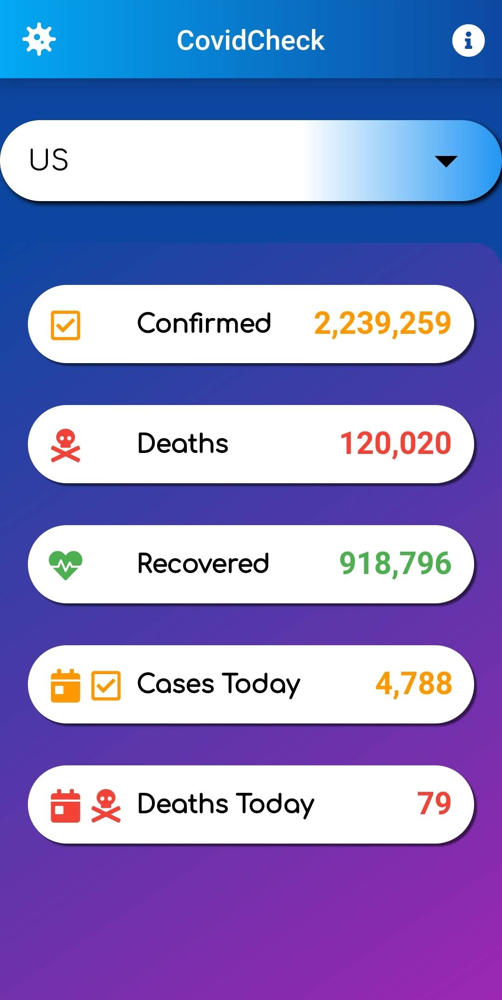
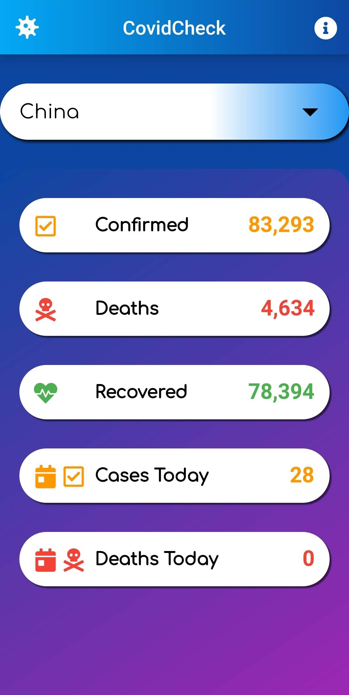

# CovidCheck

A simple, minimal Android app made using Dart to display statistics regarding COVID-19, both globally and per country. Android Studio was the IDE used for this app.

Stats include: 

- Confirmed Cases
- Deaths
- Recovered 
- Cases Today
- Deaths Today

# How it Works

The user picks a location from the dropdown button at the top. The statistics for that location or globally are retrieved using an API called NovelCOVID. 

# Stage of Completion

Finished. May change splash screen or add more features in the future.

# Screenshots

Screenshots taken around 16:20 GMT +0 on 18/06/2020

<h3>Global Stats</h3>

<h3>Country List</h3>

<h3>US Stats</h3>

<h3>China Stats</h3>

